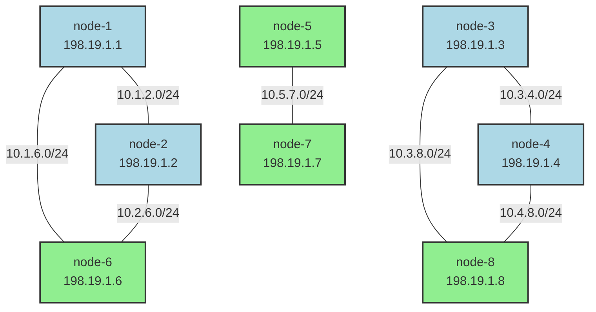

# Network Topology - Mermaid Diagram

```mermaid
graph TB
    classDef xrv fill:#ADD8E6,stroke:#333,stroke-width:2px
    classDef xrd fill:#90EE90,stroke:#333,stroke-width:2px

    node-1["node-1<br/>198.19.1.1"]
    node-2["node-2<br/>198.19.1.2"]
    node-3["node-3<br/>198.19.1.3"]
    node-4["node-4<br/>198.19.1.4"]
    node-5["node-5<br/>198.19.1.5"]
    node-6["node-6<br/>198.19.1.6"]
    node-7["node-7<br/>198.19.1.7"]
    node-8["node-8<br/>198.19.1.8"]

    node-1 ---|10.1.2.0/24| node-2
    node-1 ---|10.1.6.0/24| node-6
    node-2 ---|10.2.6.0/24| node-6
    node-3 ---|10.3.4.0/24| node-4
    node-3 ---|10.3.8.0/24| node-8
    node-4 ---|10.4.8.0/24| node-8
    node-5 ---|10.5.7.0/24| node-7

    class node-1 xrv
    class node-2 xrv
    class node-3 xrv
    class node-4 xrv
    class node-5 xrd
    class node-6 xrd
    class node-7 xrd
    class node-8 xrd
```